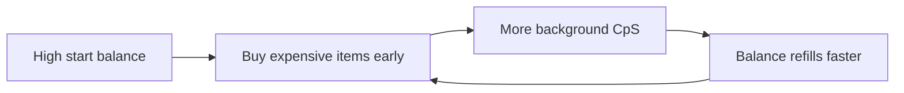
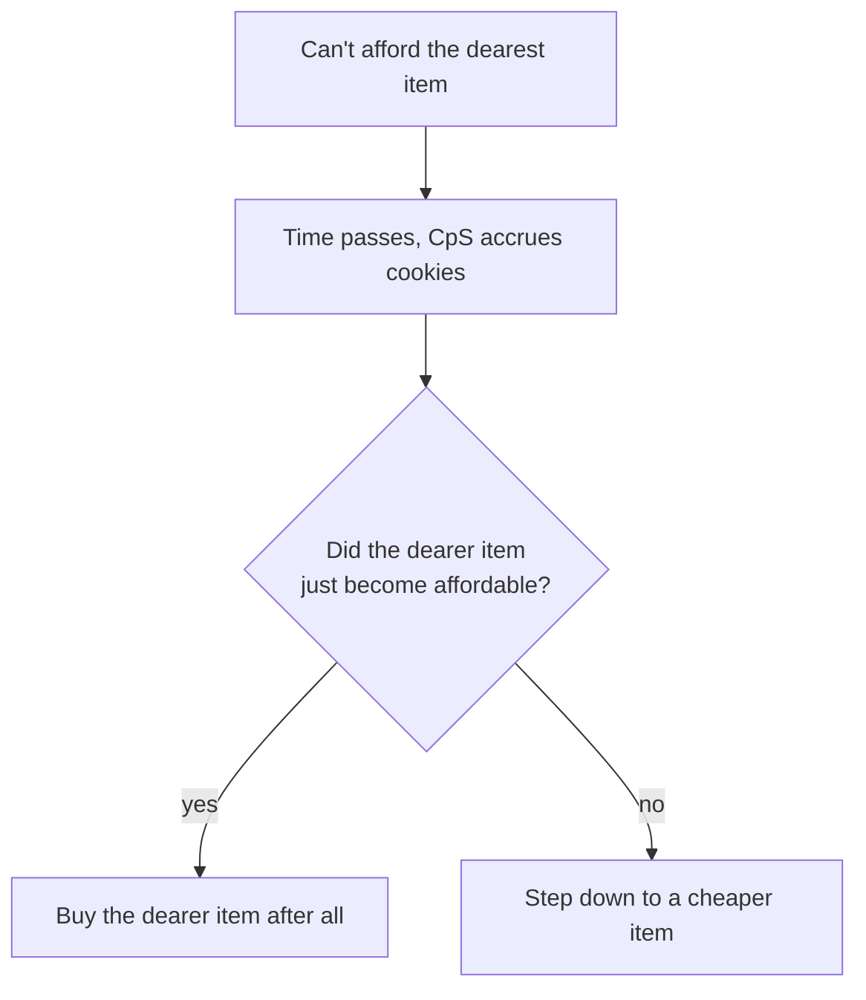
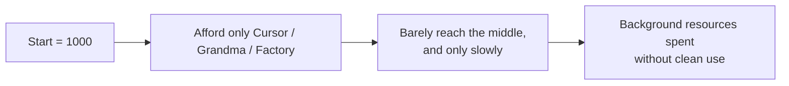
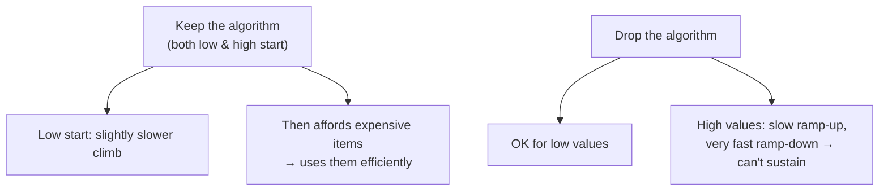
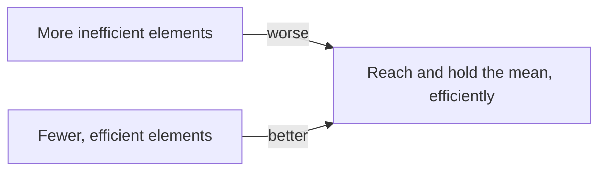
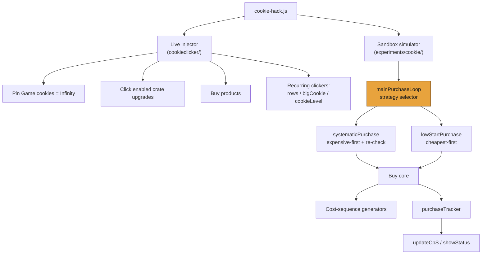
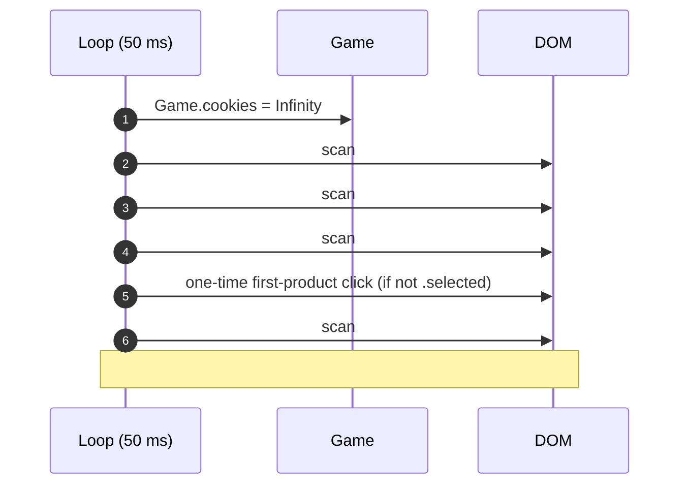
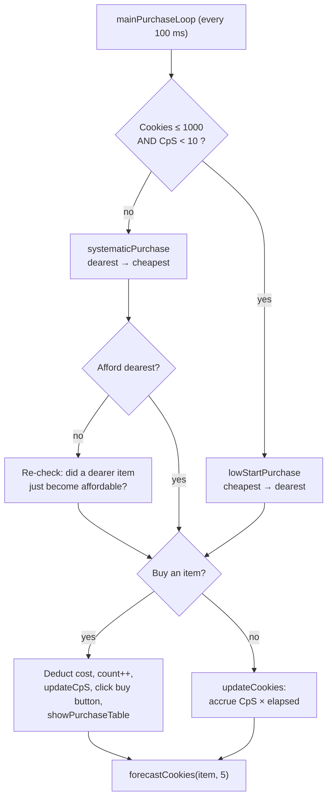
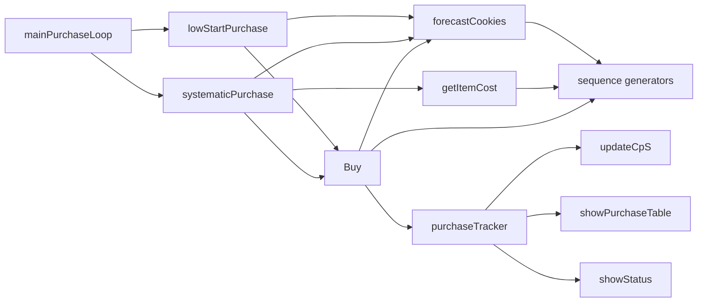

<div align="center">
  
  <h1>🍪 CookieClickHack</h1>
  <p><em>A smart automation script for the legendary Cookie Clicker game.</em></p>

  
</div>

---

## 🚀 About the Project

**CookieClickHack** is a browser-console automation snippet for the classic
[Cookie Clicker](https://orteil.dashnet.org/cookieclicker/) game. It simulates
infinite cookies and auto-buys upgrades and products — helping you reach Cookie
God status without breaking a sweat.

Perfect for developers who want to tinker, or for anyone who just wants to skip
the grind.

The repository actually contains **two complementary pieces** that share one
file, `cookie-hack.js`:

1. **The live injector** — for the real game at
   [`orteil.dashnet.org/cookieclicker/`](https://orteil.dashnet.org/cookieclicker/).
   A fast `setInterval` loop that pins `Game.cookies` to `Infinity` and clicks
   every purchasable upgrade, product, and the big cookie itself.
2. **The sandbox simulator** — for the minimalist experiment at
   [`orteil.dashnet.org/experiments/cookie/`](https://orteil.dashnet.org/experiments/cookie/).
   A self-contained purchasing engine that models cookies-per-second (CpS),
   tracks every purchase, forecasts future costs, and chooses between two buying
   strategies. This is where the interesting engineering lives.

---

## 🧠 Design & Reasoning

> *Why bother with all this — it's only a cookie clicker?*

For me, working out a **clean solution** to this cheat was genuinely exciting.
Along the way I tried many quite different approaches, and each approach turned
out to have its own distinct advantages and disadvantages. The notes below are
the reasoning behind how this tool tries to dedicate itself to **efficiency**.

### The high-start-value thesis

My first line of thought was this: with a **relatively high starting cookie
count**, you can solve the problem by buying the **more expensive elements**
early, so that from the very beginning a large amount of cookies is generated in
the background. This depends heavily, of course, on which starting cookie value
you begin with. To adapt well to efficiency, the starting value should be as
high as possible — say, beginning at **100000**.

The idea of concentrating on more expensive elements can be very advantageous:
already at the start you can buy many expensive elements, and they contribute to
new cookies being produced faster in the background — so the balance climbs back
up to a sufficiently high value for the next expensive element quickly enough.



### The "re-check before dropping down" mechanism

The background logic adds one more thing. The engine buys the **most expensive
affordable element**; when it can no longer afford that, it steps down to a
less-expensive element — **but** when you compare, some time has passed, and in
that time new cookies may have accumulated, possibly enough. So **before
committing to the cheaper purchase, it runs one more comparison** to check
whether the more expensive element has suddenly become worthwhile again — and
then, most of the time, the more expensive element is bought after all.

Because the higher the starting value, the more expensive elements you own; the
more that is produced in the background; and the more the cookie generation can
diverge during the comparison window against the cheaper option — **the faster a
purchase of a more expensive element pays for itself.**



### Why a low start (1000) is a poor fit for this mechanism

This background mechanism behaves worse, and is less suitable, when the cookie
starting value is set to **1000**. With that, you can only buy Cursor, Grandma,
or Factory at the beginning. You barely reach the *middle* of the range from
cheapest to most expensive — or only after a very long time — and in the
meantime a lot of background resources are required that are not really used
cleanly, so much of it is for nothing.



On top of that: if you check before buying whether you can *somehow* still
afford a slightly more expensive element — even though the probability of that
is very low, because right at the start you only have very few cookies to work
with — and if you can't buy the expensive elements at the very start, then why
would you focus on the expensive ones at all? That doesn't really make sense. If
you *can* somehow afford to wait and to spend this precious resource, the plan
may still work in principle, but it is not efficient.

### Why the two design choices are coupled

If you did **not** focus the algorithm on buying the more expensive elements,
then the pre-purchase comparison — the one aimed at "could I buy the more
expensive element in the meantime after all?", which is exactly what the
algorithm focuses on for the more expensive buying decisions — would have to be
**removed**, so that it doesn't fire.

The big disadvantage, however, would be this: as purchases pile up toward the
more expensive elements over time, and you don't improve the algorithm
accordingly, it starts to work inefficiently again — because in the meantime,
through the pre-sale comparison for a more expensive element, the probability
would rise that you *can* afford the more expensive element after all, and you'd
have been able to save resources that you now don't use well. Without the
comparison, the algorithm behaves like this: as soon as it moves from the
cheapest to a somewhat more expensive element and can no longer afford the more
expensive one (or one a step higher), it turns **much faster back to the
cheapest possible purchase** and then has to slowly work its way up again — even
though it could perhaps re-afford the more expensive elements sooner, yet
instead it crawls up slowly.

### The symmetric failure mode

The same holds in reverse. If you set a **high** starting value but the
algorithm does **not** concentrate on buying the more expensive elements, then
you buy the too-cheap elements far too quickly — even though, for that same
price, you could lean a little more toward the expensive direction and thereby
reach *more* faster, instead of reaching *little* slowly. In that case the
algorithm starts somewhat higher up, but sinks back into the depths very fast,
and stays stuck there longer, before approaching the middle again.

### Keeping the algorithm regardless of the start value

By **keeping this algorithm** — whether the starting value is low or high — the
only negative point is that when the starting value is low, it takes a bit
longer to climb; but as soon as it can afford the more expensive elements, it
knows how to put them to efficient use.

If you do **not** keep this algorithm, it is only suitable for lower values; but
as soon as higher values are added, it stops working, and you get a slow
ramp-up and a very fast ramp-down — which, over a longer period, cannot really
sustain the performance.



### It's not only about reaching the mean — it's about holding it

Because it does not come down only to reaching the **mean** (the midpoint)
quickly, but also to **holding it and tending to raise it**. It is not only
important to reach the mean faster, but also to keep it **constant and
efficient**. The additional algorithm covers at least one point fully — reaching
the mean in the shortest possible time — which is, of course, the highest
criterion it achieves.

### Less is more

The saying from the book **_The Mythical Man-Month_** fits best here:

> *"Nine women can't make a baby in one month."*

That is: just because there are nine women does not mean they can bear a child
faster. **Less is more** — and so it is with this project too. More inefficient
elements are not good; but fewer, efficient elements matter substantially, also
with respect to the goal of this mission: reaching the mean faster, and its
efficiency too.



---

## 🏗️ Architecture

At the top level the file splits into the two independent tools described above.
The live injector is a single timed loop of DOM clicks; the sandbox simulator is
a small purchasing engine built from a strategy selector, two strategies, a
`Buy` core, a set of cost-sequence generators, and a purchase tracker.



---

## 🔁 How It Works

### Part 1 — The live injector (one tick)

Every 50 ms the loop does the following, guarding each step on the element
existing:

1. Pin `Game.cookies = Infinity`.
2. Click every **enabled crate upgrade** in the `#toggleUpgrades`,
   `#techUpgrades`, and `#upgrades` containers.
3. Buy **products** in `#products`: a one-time targeted click on the first
   product's slot (guarded by the `.selected` class), then a click on every
   product that is `unlocked`, `enabled`, and not `disabled`.
4. Keep three recurring clickers running: the `#rows` level-up buttons (once per
   second), the `#bigCookie` (every 50 ms), and the cookie-level control (every
   50 ms).

`Game.heavenlyChips` is set once, at load, to a very large value.



### Part 2 — The sandbox simulator (one purchase cycle)

Every 100 ms, `mainPurchaseLoop()` decides which strategy to run:

- If cookies are at or below the **low-start threshold** (1000) *and* total CpS
  is below the **switch threshold** (10), it runs `lowStartPurchase()` —
  cheapest-first.
- Otherwise it runs `systematicPurchase()` — most-expensive-first, with the
  re-check described above.

A successful purchase deducts the cost, increments the item count, records the
cost, updates total CpS, clicks the matching `buy<Item>` DOM button, and prints
a purchase table. When nothing is affordable, `updateCookies()` accrues cookies
from elapsed time × CpS, and a five-purchase forecast is printed.



---

## 🧩 Dependencies & Relations

The simulator's parts relate as follows: `mainPurchaseLoop` selects a strategy;
each strategy calls the shared `Buy` core; `Buy`, `getItemCost`, and
`forecastCookies` all resolve an item's price through the cost-sequence
generators; every purchase updates the shared `purchaseTracker`, which in turn
feeds `updateCpS`, `showPurchaseTable`, and `showStatus`.



- **`purchaseTracker`** — per-item `{ count, costs, totalCost }`. The single
  source of truth for how many of each item is owned.
- **`purchaseOrder`** — items sorted by ascending initial cost. `lowStartPurchase`
  walks it forward; `systematicPurchase` walks it backward.
- **`cpsValues`** — CpS contributed per unit of each item, used by `updateCpS`.
- **Sequence generators** — turn an item + owned-count into the next unit price.

---

## 🧭 The two strategies in code

### Most-expensive-first, with the re-check (`systematicPurchase`)

This is the strategy the design essay is about: buy the most expensive item you
can afford; if you can't, look **upward** first to see whether an even more
expensive item just became affordable, and only then fall back.

```javascript
function systematicPurchase() {
  let purchased = false;

  // Start with the most expensive item
  for (let i = purchaseOrder.length - 1; i >= 0; i--) {
    const item = purchaseOrder[i];
    console.log(`Versuche Kauf von ${item}...`);

    // Attempt purchase
    if (Buy(item)) {
      purchased = true;
      lastUpdateTime = Date.now(); // Reset time after purchase
      break; // Exit loop after a successful purchase
    } else {
      // Check if a more expensive item is affordable after waiting
      for (let j = purchaseOrder.length - 1; j > i; j--) {
        const moreExpensiveItem = purchaseOrder[j];
        if (Cookies >= getItemCost(moreExpensiveItem)) {
          console.log(
            `Teureres Item ${moreExpensiveItem} ist jetzt erschwinglich!`
          );
          if (Buy(moreExpensiveItem)) {
            purchased = true;
            lastUpdateTime = Date.now(); // Reset time after purchase
            break;
          }
        }
      }
      if (purchased) break; // Exit outer loop if a purchase was made
    }
  }

  // If no purchase was possible, update cookies and wait
  if (!purchased) {
    updateCookies();
    console.log(
      `Keine Käufe möglich mit ${Cookies} Cookies. Warte auf neue Cookies...`
    );
  }

  // Forecast for the most expensive item
  const mostExpensiveItem = purchaseOrder[purchaseOrder.length - 1];
  forecastCookies(mostExpensiveItem, 5);

  // Show table after each cycle
  showPurchaseTable();
}
```

### Cheapest-first, for a low start (`lowStartPurchase`)

The simpler counterpart for the early game: walk the order forward and buy the
first affordable (cheapest) item. No upward re-check — at a low start it would
almost never pay off.

```javascript
function lowStartPurchase() {
  let purchased = false;

  // Start with the cheapest item
  for (let i = 0; i < purchaseOrder.length; i++) {
    const item = purchaseOrder[i];
    console.log(`Versuche Kauf von ${item} (niedriger Startwert)...`);

    // Attempt purchase
    if (Buy(item)) {
      purchased = true;
      lastUpdateTime = Date.now(); // Reset time after purchase
      break; // Exit loop after a successful purchase
    }
  }

  // If no purchase was possible, update cookies and wait
  if (!purchased) {
    updateCookies();
    console.log(
      `Keine Käufe möglich mit ${Cookies} Cookies. Warte auf neue Cookies...`
    );
  }

  // Forecast for the cheapest item
  const cheapestItem = purchaseOrder[0];
  forecastCookies(cheapestItem, 5);

  // Show table after each cycle
  showPurchaseTable();
}
```

---

## ✨ Features

- 🍪 Sets cookies to `Infinity` continuously
- 🛒 Automatically buys available upgrades and products
- 🚫 Ignores items priced `Infinity`
- 🎯 Optionally targets specific product slots
- ⚙️ Customizable click interval
- 🧠 Two adaptive buying strategies (cheapest-first vs. expensive-first) selected
  automatically from the current balance and CpS

---

## 🛠️ Setup

1. Open [Cookie Clicker](https://orteil.dashnet.org/cookieclicker/).
2. Open your browser's developer console (F12, or right-click → Inspect →
   Console).
3. Paste the relevant part of the script and hit **Enter** — the live-injector
   block for the main game, or the simulator block for the experiments page.

---

## 💻 Code Example

The heart of the live injector: pin cookies to infinity and click every
purchasable upgrade and product each tick.

```javascript
setInterval(() => {
  Game.cookies = Infinity;

  // Upgrade logic
  const upgradesContainer = document.getElementById("upgrades");
  if (upgradesContainer) {
    Array.from(upgradesContainer.children).forEach((upgrade) => {
      if (
        upgrade.classList.contains("crate") &&
        upgrade.classList.contains("upgrade") &&
        upgrade.classList.contains("enabled")
      ) {
        upgrade.click();
      }
    });
  }

  // Product logic
  const productsContainer = document.getElementById("products");
  if (productsContainer) {
    Array.from(productsContainer.children).forEach((product) => {
      const priceText = product.querySelector("span.price")?.textContent?.trim();
      if (
        product.classList.contains("product") &&
        product.classList.contains("unlocked") &&
        product.classList.contains("enabled") &&
        priceText !== "Infinity"
      ) {
        product.click();
      }
    });
  }
}, 500);
```
